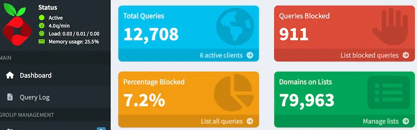

### 파이홀이란?
연결된 기기들의 DNS 조회를 받아서 광고, 트래커를 걸러주는 서버입니다. 차단 목록 내용에 따라 차단 유무는 다를 수 있습니다.

파이홀이 막을지 말지 결정하고 언바운드에 넘겨주는 형태로 설정했습니다.

---

### 파이홀 설치
```bash
# 디렉토리 생성
mkdir -p ~/pihole && cd ~/pihole

# 웹 UI 비밀번호 생성 후 .env에 저장
echo "PIHOLE_PASSWORD=$(openssl rand -base64 32)" > .env
chmod 600 .env
cat .env

# compose 작성
nano docker-compose.yml

# 아래 내용 작성
services:
  pihole:
    image: pihole/pihole:2026.07.2
    container_name: pihole
    ports:
      - "<파이 IP>:53:53/tcp"
      - "<파이 IP>:53:53/udp"
      - "127.0.0.1:8080:80/tcp"
    environment:
      TZ: Asia/Seoul
      FTLCONF_webserver_api_password: ${PIHOLE_PASSWORD}
      FTLCONF_dns_listeningMode: ALL
      FTLCONF_dns_upstreams: <파이 IP>#5335
    volumes:
      - pihole-etc:/etc/pihole
    restart: unless-stopped
    deploy:
      resources:
        limits:
          cpus: '0.5'
          memory: 512M

volumes:
  pihole-etc:
```

#### 실행 및 확인
```bash
# 변수가 잘 채워졌는지, 문법 오류는 없는지 먼저 확인
docker compose config

docker compose up -d
docker compose logs --tail 40

# 메모리 제한이 실제로 걸렸는지 (512MiB로 나와야 함)
docker stats --no-stream pihole

# 일반 도메인 → IP가 나와야 함
dig @<파이 IP> google.com +short

# 광고 도메인 → 0.0.0.0이 나와야 함
dig @<파이 IP> doubleclick.net +short
```

웹 UI는 `127.0.0.1`에만 열어둬서 파이 안에서만 접속됩니다. 다른 기기에서 보려면 SSH 포워딩으로 연결해주면 됩니다.

```zsh
# 맥북에서 접속할 경우
ssh -L 8080:127.0.0.1:8080 <파이 IP>
```

이후 `http://localhost:8080/admin` 접속하고 `.env`에 넣었던 비밀번호로 로그인하면 됩니다. 차단 리스트는 취향대로 커스텀 하는게 나을거 같아서 다루지는 않았습니다.



하루정도 써본 결과 기본 차단 리스트만 있어서 광고 제거보단 추적 차단 정도 효과가 더 있는거 같습니다.
