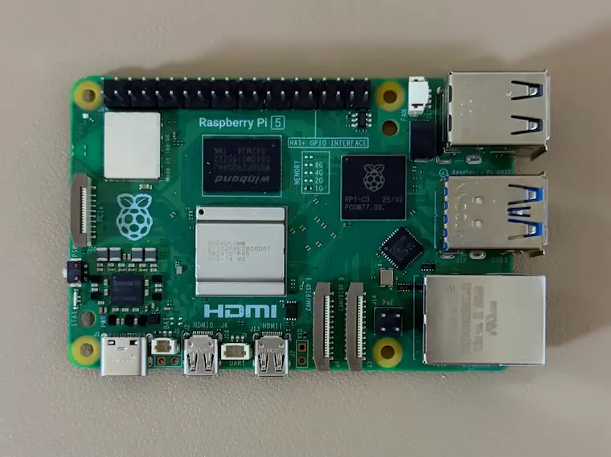
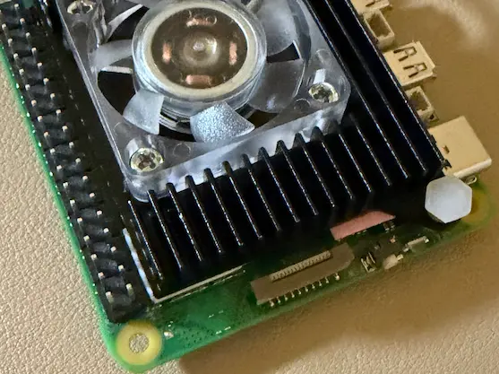

### 파이홀, 언바운드를 위한 새 기기
가성비를 따지는 프로젝트는 아니고 네트워크에 관련되어 있다 보니 기존 파이와 다른 파이에 올리는게 좋을거 같아서 파이5 1GB 모델로 구해서 조립했습니다.




일렉트로쿠키 케이스 + 쿨러 + M.2 HAT까지 한번에 포함된 구성품으로 약 3만원 중반대에 구매했는데 가성비는 매우 좋지만 단차가 살짝 아쉽고, 나사탭? 이 살짝 무른 느낌이었습니다. 위 사진처럼 써멀패드도 딱 맞기 보다는 살짝 튀어나온것도 보였습니다.

추후에 케이스랑 쿨러, 햇은 교체해볼 생각입니다.

---

### 파이 IP 설정
먼저 파이에 고정 IP부터 할당하고 진행합니다.

```bash
# 연결 이름 확인
nmcli connection show

# 공유기에서 먼저 고정 IP 할당했고, 게이트웨이는 공유기 IP로 넣었습니다
# 1.1.1.1는 클라우드플레어 DNS, 9.9.9.9는 Quad9 DNS
sudo nmcli connection modify "조회한 이름" \
  ipv4.method manual \
  ipv4.addresses <파이 고정 IP> \
  ipv4.gateway <공유기 IP> \
  ipv4.dns "1.1.1.1,9.9.9.9" \
  ipv6.method disabled

sudo nmcli connection down "조회한 이름" && \
sudo nmcli connection up "조회한 이름"

# 설정 확인, 파이 유선은 보통 eth0
ip -4 addr show eth0

# 와이파이, 블루투스 비활성화, 메모리 조금이라도 절약하게
sudo nano /boot/firmware/config.txt

# [all] 아래 해당 내용 입력
dtoverlay=disable-wifi
dtoverlay=disable-bt

# 메모리 컨트롤러 활성, 도커 메모리 제한용
sudo nano /boot/firmware/cmdline.txt

# 중요 : 아래 내용이 줄바꿈 없이, 공백 한칸 뒤 작성돼야함
# 잘못 입력되면 부팅 안될수 있음
cgroup_enable=memory cgroup_memory=1

# 재부팅 후 확인
sudo reboot

cat /sys/fs/cgroup/cgroup.controllers

# 와이파이 꺼졌으면 아무것도 안나옴
ip link show | grep wlan

# ssh 보안 강화
sudo nano /etc/ssh/sshd_config

# PermitRootLogin 검색 후 주석 해제, 값 no로 변경
PermitRootLogin no

# ssh재시작
sudo systemctl restart ssh
```

---

### ufw 방화벽 설정
스킵해도 상관은 없겠지만 저는 해두는 편입니다.

```bash
# 설치
sudo apt install -y ufw
sudo ufw default deny incoming
sudo ufw default allow outgoing

# 기본 설정
sudo ufw allow from <내부망 대역> to any port 22 proto tcp

# 파이홀이 53번 포트로 DNS 요청을 받음
sudo ufw allow from <내부망 대역> to any port 53

# 파이홀 컨테이너가 호스트 LAN 주소로 5335를 물어보는데
# 이 규칙이 없으면 ufw 기본 deny에 걸려 timeout 남
# 172.16.0.0/12 는 노출되도 상관 없는 도커 대역임
sudo ufw allow from 172.16.0.0/12 to any port 5335

# Beszel 모니터링용, 없으면 설정 필요 X
sudo ufw allow from <다른 파이 IP> to any port 45876 proto tcp

# 활성화
sudo ufw enable
sudo ufw status verbose
```

내용이 길어져서 다음 포스트에서 언바운드부터 이어가도록 하겠습니다.
