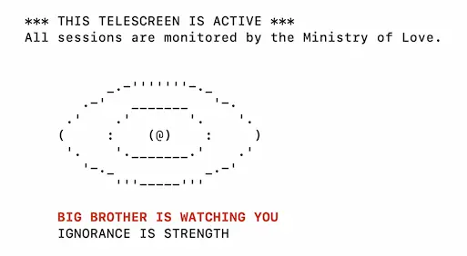
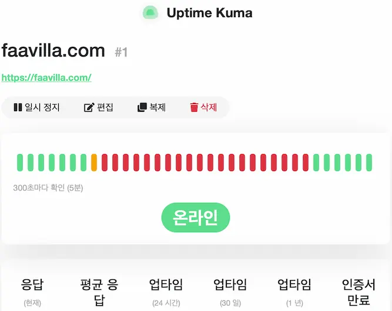
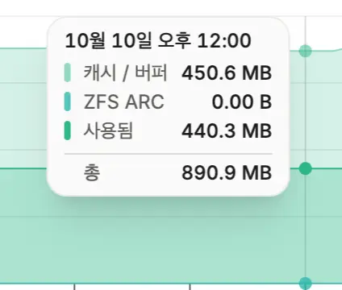

### 파이 프로젝트 초기화
우마미(8GB 모델) : 잘 안보게 되고, 추적도 없애려고 하다보니, 포맷 후 다른 프로젝트 생각중입니다.  
파이홀, 언바운드(1GB 모델) : VPN 사용으로 두 서비스의 필요성이 크지 않게 되어서 업타임 쿠마를 올려보려고 합니다.

---

### 1GB 모델 포맷 후 업타임 쿠마 설치
8GB 모델은 나중에 생각해보기로 하고, 일단 1GB 모델 포맷 후 기존처럼 ufw, 로그인 비번 끄고 SSH 접속으로만 세팅해두었습니다.

이름은 조금 재밌게 해볼까 해서 빅브라더로 지어놨고, SSH 접속하면 간단하게 빅브라더가 보고 있다는 경고까지 띄우게 해봤습니다.



```bash
# 폴더 생성, 파일 생성 후 내용까지 한번에
# <파이 IP>는 실제 IP로 바꾼 뒤 붙여넣기
mkdir -p ~/uptime-kuma && cd ~/uptime-kuma
cat > docker-compose.yml <<'EOF'
services:
  uptime-kuma:
    image: louislam/uptime-kuma:2.5.5-slim
    container_name: uptime-kuma
    restart: unless-stopped
    ports:
      - "<파이 IP>:3001:3001"
    volumes:
      - ./data:/app/data
    deploy:
      resources:
        limits:
          memory: 256M
          cpus: "1.0"
EOF

# 시작 및 로그 확인
docker compose up -d
docker compose logs -f
```

슬림버전으로 필요없는 기능은 빼고, 최대한 가볍게 해보려고 했습니다.  
포트를 127.0.0.1이 아닌 파이 IP로 한 이유는, 이번에 SSH 말고 동일 네트워크에 있는 휴대폰으로도 접속해 보려고 파이 IP로 지정했습니다.

도커로 연 포트는 ufw를 거치지 않아서, 접속 범위는 앞에 적은 IP로 정해집니다. 같은 네트워크에 있는 기기라면 모두 접속할 수 있습니다.

---

### 구동 확인, 메모리 사용량 확인


중간에 빨간색 뜬건 공유기가 IP할당을 못받고 있었던 상황이라 확인 요청을 못 보내서 중지된거처럼 기록됐습니다.



Beszel까지 설치 후 메모리 사용량을 보니, 어느정도 여유 있어서 작은 서비스는 하나정도 더 올려봐도 좋을것 같습니다.
